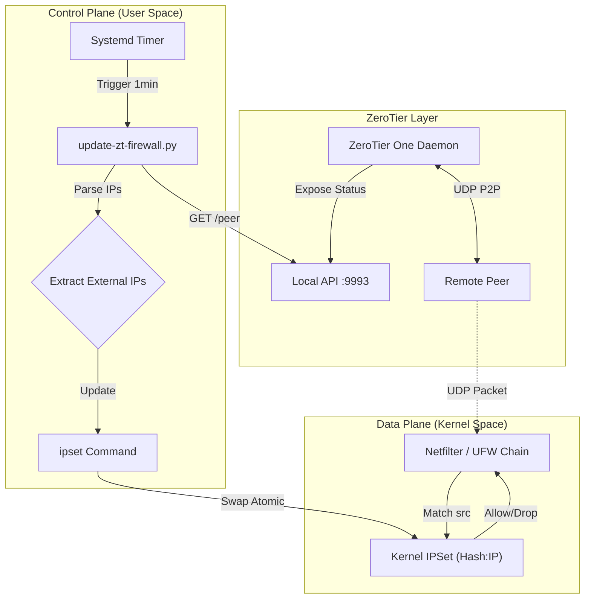

# ZeroTier UDP Puncher


**[日本語](README_ja.md)** | English

**Engineered for Reliability: Dynamic, High-Performance Firewall Hole Punching for ZeroTier**

This tool dramatically increases the success rate of ZeroTier P2P (Direct) connections by dynamically managing UFW firewall rules via IPSet. It solves the critical problem of UDP packet blocking in strict Linux firewall environments without compromising security by opening wide port ranges.

## Table of Contents
- [Architecture & Data Flow](#architecture--data-flow)
- [Key Features](#key-features)
- [Components & Configuration](#components--configuration)
  - [Prerequisites](#prerequisites)
  - [Installation](#installation)
  - [Configuration](#environment-variables-advanced-configuration)
- [Observability & Troubleshooting](#observability--troubleshooting)
- [Security Model](#security-model--why-haship)
- [Uninstall](#uninstall)
- [License](#license)

---

## 🏗️ Architecture & Data Flow

Detailed interaction between the system components: ZeroTier, the Python update logic, Systemd timers, and the Kernel's Netfilter subsystem.



## 🚀 Key Features

### 1. O(1) Packet Filtering Performance
Unlike traditional firewall scripts that append `iptables` rules linearly (O(n) complexity), this tool utilizes **IPSet** (`hash:ip` type).
*   **Linear Rules (Bad)**: 100 peers = 100 sequential rule checks for *every* incoming packet.
*   **IPSet (Good)**: 100 peers = **1 hash lookup** (O(1)).
This ensures that CPU load remains negligible even if your ZeroTier network scales to thousands of peers.

### 2. Solved: The Systemd "Boot Loop" Race Condition
A common pitfall in persisting ipsets with UFW is the circular dependency/race condition during boot:
1.  `ufw.service` loads rules.
2.  Rules reference `ipset` sets (e.g., `zt-peers-v4`).
3.  If the sets don't exist yet, **UFW fails to start**.
4.  Standard persistence services often start *after* networking or *in parallel* with UFW, leading to unpredictable boot failures.

**Our Solution**:
We utilize the **UFW `before.init` hook** (`/etc/ufw/before.init`).
This shell script is executed synchronously **immediately before** UFW commands are run. By injecting the `ipset create` commands here, we guarantee:
*   Sets exist *before* any rule references them.
*   Zero dependency on Systemd service ordering.
*   **100% Reboot Safety**.

### 3. Atomic Updates
The Python script updates the IPSet using a **Swap-Describe** pattern:
1.  Create a temporary set (`zt-peers-v4-tmp`).
2.  Populate it with fresh IPs.
3.  **Atomically swap** the temp set with the live set (`ipset swap`).
4.  Destroy the temp set.
This ensures there is **zero downtime** or "open window" where packets could be dropped during an update.

## ⚙️ Components & Configuration

### Prerequisites
*   Linux (Debian/Ubuntu based) with `systemd`, `ufw`, `ipset`, `python3`.
*   ZeroTier One installed and running.

### Installation

```bash
git clone https://github.com/photoguild/zt-udp-puncher.git
cd zt-udp-puncher
chmod +x install_zt_puncher.sh
sudo ./install_zt_puncher.sh
```

### Environment Variables (Advanced Configuration)
The core logic is in `/usr/local/bin/update-zt-firewall.py`. You can modify the generated systemd service file to override these variables if needed.

| Variable | Default | Description |
| :--- | :--- | :--- |
| `ZT_API_URL` | `http://localhost:9993/peer` | Local ZeroTier API Endpoint |
| `ZT_TOKEN_PATH` | `/var/lib/zerotier-one/authtoken.secret` | Path to the API authentication token |
| `ZT_TIMEOUT` | `10` | Timeout (seconds) for API calls and subprocs |
| `ZT_IPSET_V4` | `zt-peers-v4` | Name of the IPv4 ipset |
| `ZT_IPSET_V6` | `zt-peers-v6` | Name of the IPv6 ipset |

## 🛠️ Observability & Troubleshooting

### Check Service Status
```bash
systemctl status zt-firewall-update.timer
systemctl status zt-firewall-update.service
```

### Inspect the Firewall State
Verify that the `before.rules` injection is working and matching packets:
```bash
# Check UFW status (look for "zt-peers-v4")
sudo ufw status verbose

# List the actual IPs currently whitelisted
sudo ipset list zt-peers-v4
```

### Logs
Structured logging is sent to journald via stdout/stderr.
```bash
journalctl -u zt-firewall-update.service -f
```

## 🔐 Security Model / Why `hash:ip`?
We consciously chose `hash:ip` (single IP addresses) over `hash:net` (subnets).
ZeroTier peers often reside on dynamic residential IPs. Whitelisting entire subnets (e.g., /24) would expose your UDP ports to potential neighbors or other users on the same ISP node.
By strictly limiting the whitelist to the **exact detected global IP** of the authenticated peer, we maintain the "Least Privilege" principle.

## 🗑️ Uninstall

Cleanly remove all services, timers, scripts, and revert UFW/IPSet configurations:

```bash
sudo ./uninstall_zt_puncher.sh
```

## 📄 License

This project is licensed under the MIT License - see the [LICENSE](LICENSE) file for details.
